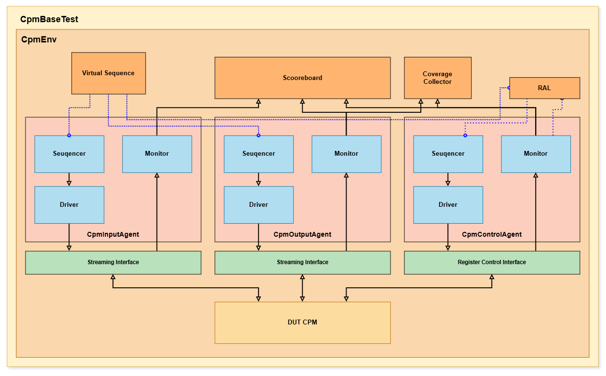
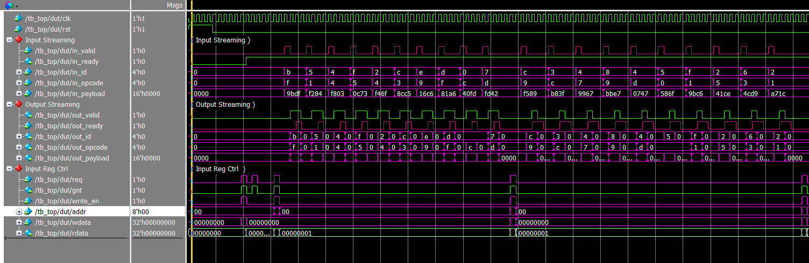
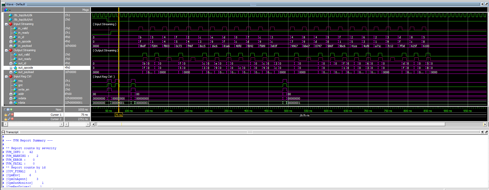

# CPM (Configurable Packet Modifier) – UVM Verification Environment

## Project Overview

This project implements a comConfigurable Packet Modifierplete **UVM-based verification environment** for the *Configurable Packet Modifier (CPM)*.

The DUT is a single-beat packet processing block that performs deterministic data transformations (PASS, XOR, ADD, ROT) and optional packet dropping based on opcode-driven configuration registers.

### Key Features Verified

- **Deterministic Latency** – 0–2 cycles depending on processing mode  
- **Handshake Protocol Compliance** – Ready/Valid flow control with full backpressure support  
- **Strict Ordering** – FIFO in-order packet processing  
- **Counter Integrity** – `COUNT_IN == COUNT_OUT + DROPPED_COUNT` invariant  

---

## How To Run?

### Single Test
``` bash 

# Default run (SmokeTest) (no GUI)
vsim -c -do run.do #(with GUI delete the -c)
# Run with Configuration:
vsim -c -do "set TESTNAME StressTest; set VERBOSITY UVM_HIGH; do run.do"
# With Different Seeds
vsim -c -do "set SEED 1234; do run.do"

```
### Regression Test
``` bash
# Run Regression Test (SmokeTest then StressTest)
vsim -c -do regression.do
# After Regression Done you can open the merged coverage
vsim -viewcov cov_merged.ucdb

```

### Python Run:
``` bash
python Scripts/run.py --gui --test SmokeTest --seed 1


```

## UVM Architecture

The environment follows a modular UVM architecture with strict separation between:



### Verification Components

- **MyInputAgent**  
  Drives packet `id`, `opcode`, and `payload` on the Streaming Input Interface.

- **MyOutputAgent**  
  Controls `out_ready` to simulate downstream backpressure and monitors the Streaming Output Interface.

- **MyControlAgent**  
  Performs register read/write operations using the `req/gnt` protocol.

- **RAL (Register Abstraction Layer)**  
  Mandatory configuration layer using `uvm_reg_adapter` and `uvm_reg_predictor` to mirror DUT state.

- **Scoreboard + Reference Model**  
  Samples configuration at `in_fire`, predicts expected packet transformation and latency, enforces FIFO ordering, and checks counter invariants.

---

## Stimulus & Test Strategy

A **Top Virtual Sequence** coordinates traffic generation and dynamic configuration.

### Test Scenarios

1. **Smoke Test**  

   - Reset validation  
   - RAL connectivity  
   - Basic traffic across PASS, XOR, ADD, ROT modes 
   - The streaming drives set in Fork-Join for parallel reading and writing.

2. **Stress Test**  

   - High-density randomized traffic  
   - Randomized backpressure  
   - Continuous invariant checking  
   - The streaming drives set in Fork-Join for parallel reading and writing.

3. **Drop Test**  

   - Configures DROP_EN and DROP_OPCODE  
   - Verifies correct packet suppression  
   - Validates `DROPPED_COUNT` behavior
   - Reading and writing behavior needs an update.  
 

---

## Coverage & Closure Results

Functional closure was achieved by meeting all defined coverage targets.

| Metric | Target | Result |
|:---|:---|:---|
| **MODE Coverage** | 100% | **Achieved** |
| **OPCODE Coverage** | ≥ 90% | **Achieved** |
| **Cross (MODE × OPCODE)** | ≥ 80% | **Achieved** |
| **Drop Event Bin** | Hit ≥ 1 | **Achieved** |
| **Stall Event Bin** | Hit ≥ 1 | **Achieved** |

Structural coverage (line, branch, toggle) exceeded 90%.

---

## Sign-off Criteria

Verification sign-off required:

- 100% test pass rate  
- Zero scoreboard mismatches  
- No remaining expected transactions at end-of-test  
- All SystemVerilog Assertions (SVA) passed  
- Functional and structural coverage targets met  
- Counter invariant continuously verified  

---

**Author:** Meitar Shimoni  
**Date:** 17/02/2026  


BUGS found:


spec mention : roatate has a parameter ROT_AMT. but cannot be configured anywhere! 