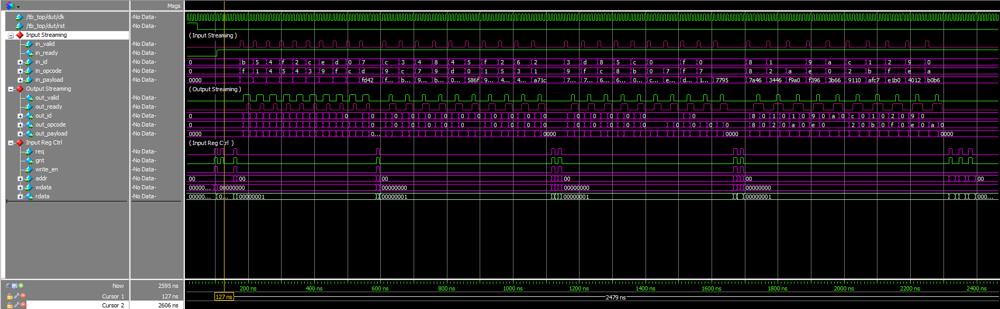
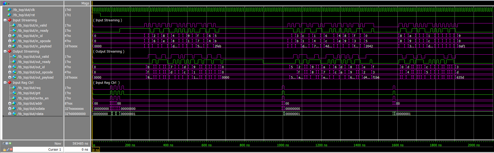

# CPM (Configurable Packet Modifier) – UVM Verification Environment

## Project Overview

This project implements a comConfigurable Packet Modifierplete **UVM-based verification environment** for the *Configurable Packet Modifier (CPM)*.

The DUT is a single-beat packet processing block that performs deterministic data transformations (PASS, XOR, ADD, ROT) and optional packet dropping based on opcode-driven configuration registers.

## Verification Architecure:

### Verification Components

- **CPM_In_Agent**  
  Drives packet `id`, `opcode`, and `payload` on the Streaming Input Interface.

- **CPM_Out_Agent**  
  Controls `out_ready` to simulate downstream backpressure and monitors the Streaming Output Interface.

- **CPM_Reg_Agent**  
  Performs register read/write operations using the `req/gnt` protocol. To configure the modes of the CPM (XOR, ADD, ROT, DROP, PASS)

- **RAL (Register Abstraction Layer)**  
  Mandatory configuration layer using `uvm_reg_adapter` and `uvm_reg_predictor` to mirror DUT state.

- **Scoreboard + Reference Model**  
  Samples configuration at `in_fire`, predicts expected packet transformation and latency, enforces FIFO ordering, and checks counter invariants.

---

### Tests and Sequences

## **Smoke_Test**  

   - Reset validation  
   - RAL connectivity  
   - Basic traffic across PASS, XOR, ADD, ROT modes  

## **Stress_Test**  

   - High-density randomized traffic  
   - Randomized backpressure  
   - Continuous invariant checking

